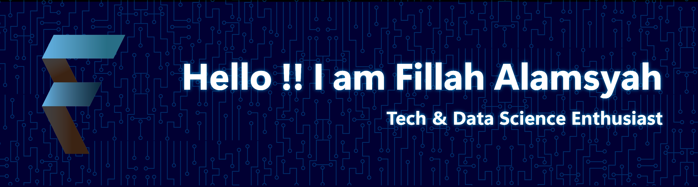

# 
Hi 👋, I'm Fillah Alamsyah

## 
A tech enthusiast passionate about Electronics, Web Dev, and Data Science from Indonesia

        
👋 Hey there! I'm a Physics student with a passion for 💻 Web Programming and 📊 Data Science. From 🔌 coding microcontrollers to 📈 building data visualizations, I love connecting the digital and physical worlds. Currently exploring 🐍 Python, ⚡ JavaScript, and various 🛠️ frameworks while working on 🚀 projects that combine my technical skills with 💡 creative problem-solving. Based in 🇮🇩 Indonesia, I'm always looking to 📚 learn and 🤝 collaborate on innovative tech solutions!

    <!--  -->
    
    
    
    

    

<!--
## 🔭 Current Work & Projects

- 🔭 I'm currently working on [F](f)
- 👯 I'm looking to collaborate on [f](f)
- 🤝 I'm looking for help with [f](f)
- 👨‍💻 All of my projects are available at [fillahalamsyah.github.io/projects](https://fillahalamsyah.github.io/projects) -->

<!--
## 📝 Writing & Communication

- 📝 I regularly write articles on [fillahalamsyah.github.io/blog](https://fillahalamsyah.github.io/blog)
- 💬 Ask me about **Astro, TypeScript**
- 📫 How to reach me: **fillahalamsyah@gmail.com**
- 📄 Know about my experiences: [fillahalamsyah.github.io/resume](https://fillahalamsyah.github.io/resume)
-->

<!-- ### Blog Posts -->

<!-- BLOG-POST-LIST:START -->
<!-- BLOG-POST-LIST:END -->

<!-- ## 🌐 Connect with me

<!--  

 -->

## 📊 GitHub Stats

<!-- 

 -->

---

## 🛠️ Languages and Tools

    
<strong>💻 Programming Languages</strong>

    

        
        
        
        
        
        
    

    
<strong>🌐 Web Development</strong>

    

        
        
        
    

    
<strong>🔧 Frameworks</strong>

    

        
        
        
    

    
<strong>📊 Data Science & Analytics</strong>

    

        
        
        
        
        
    

    
<strong>🗄️ Databases</strong>

    

        
        
    

    
<strong>🛠️ Tools & Cloud</strong>

    

        
        
        
        
    

    
<strong>🔌 Electronics</strong>

    

        
    

    
<strong>🎨 Design</strong>

    

        
        
    

